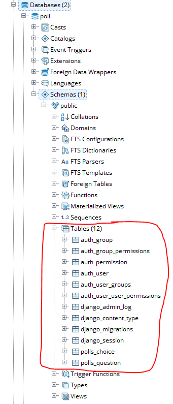
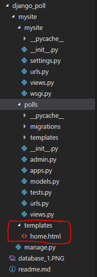
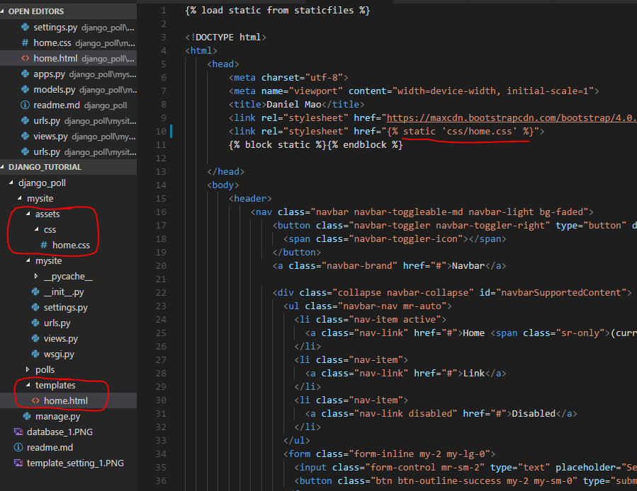
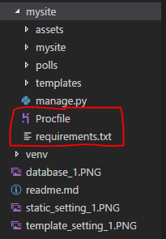

### Set up environment, create project, and create application
`virtualenv poll_project`: Create environment call poll_project in current folder.  
`poll_project\Scripts\activate`: Activate the virtual environment.  
`deactivate`: Deactivate the virtual environment  
`pip install django`: Install **django**.  
`python -m django --version`: Check django version.   

```django-admin startproject mysite``` creates a project.  
```python manage.py startapp polls``` creates a application.  

### Database Setup
The **DATABASES** in the **mysite/setting.py** defines the database.  
* **ENGINE**: database type.Eg. 'django.db.backends.postgresql'.
* **NAME**: The name of your database. It will be the full absolute path if you're using SQLite.  
If you are not using SQLite as your database, the following additional settings must be added.
* **USER**
* **PASSWORD**
* **HOST**   
Below is an example connecting **poll database** in **local postgresql server** by using **postgres users**. You have to install Postgresql on your local machine with password *3326999*, and creat a database called *poll*.
```python
DATABASES = {
    'default': {
        'ENGINE': 'django.db.backends.postgresql_psycopg2',
        'NAME': 'poll',
        'USER': 'postgres',
        'PASSWORD': '3326999',
        'HOST': 'localhost',
        'PORT': '5432',
    }
}
```
For more detials, see [DATABASES](https://docs.djangoproject.com/en/1.11/ref/settings/#std:setting-DATABASES)
### Add Applications
The **INSTALLED_APPS** in the **mysite/setting.py** holds all the activated Django applications in this Django instance. To include the app created in our project, its configuration class needs to be added in the **INSTALLED_APPS** setting.  
The **PollsConfig** class is in the **polls/apps.py** file, so its dotted path is **'polls.apps.PollsConfig'**. It'll look like this:
```python
#mysite/settings.py
INSTALLED_APPS = [
    'polls.apps.PollsConfig',
    'django.contrib.admin',
    'django.contrib.auth',
    'django.contrib.contenttypes',
    'django.contrib.sessions',
    'django.contrib.messages',
    'django.contrib.staticfiles',
]
```

Some of these applications make use of at least one database table, so you need to **create the tables in the database before you can use them**. To do this, run command: ```python manage.py migrate```. See more in Activate Models section.
### Create and Activate Models
A model is the single, definitive source of information about your data. It contains the essential fields and behaviors of the data you're storing. 
* Each model is a Python class that subclasses **django.db.models.Model**.
* Each attribute of the model represnets a database field.
* With all of this, Django gives you an automatically-generated database-access API.
Below is an example creating two models.
```python
#polls/models.py
from django.db import models
import datetime
from django.utils import timezone

class Question(models.Model):
    question_text = models.CharField(max_length=200)
    pub_date = models.DateTimeField('date published')
    #return a clear description of object in database API
    def __str__(self):
        return self.question_text
    def was_published_recently(sef):
        return self.pub_date >= timezone.now() - datetime.timedelta(days=1)

class Choice(models.Model):
    question = models.ForeignKey(Question, on_delete=models.CASCADE)
    choice_text = models.CharField(max_length=200)
    votes = models.IntegerField(default=0)
    #return a clear description of object in database API
    def __str__(self):
        return self.choice_text
```
Before activating the models just created, the application that contains the models (polls in this case) has to be added into **INSTALLED_APPS**. (described in **Add Application** section)  
  
* Command ```python manage.py makemigrations polls``` tells Django that you've made some changes to your models.  
* Command ```python manage.py sqlmigrate polls 0001``` returns SQLs.  
* Command ```python manage.py migrate``` takes all migrations and synchronizing the changes you made to your models with the schema in the database.  

After migration, tables are created automatically in the (Postgresql) database as shown below, and also, the database API can be accesed by ```python manage.py shell``` and ```from polls.models import Question, Choice```.  

### Create URL directory to call VIEWs
Below is what a View does how to call a View
* It is a Python function that takes a **Web request** and returns a **Web response**. This **Web response** can be the HTML contents of a Web page, a redirect, a 404 error, etc. 
* A view is a place where we put the **logic** of our application that is necessary to return that **Web response**. 
* It request information from the **model** you've created before and pass it to a **template** that will be created later. 
* But in order to call the view, we need to map it to a **URL directory**.  
  
**Four urls** in url directory will be created in order to call **four views** that will be created later. They are:
* **index** - display all the questions and enable user to click through to show Choices of the question (call detail view)
* **detail** - choices that the question have with vote function (call vote view)
* **vote** - alter data server-side and redirect to result view
* **results** - display results of vote for each Choices for the question and enable user to go back to detail (call detail view)
```python
#polls/urls.py
from django.conf.urls import url
from . import views

app_name = 'polls'

urlpatterns = [
    # ex: /polls/ 
    # call index view
    url(r'^$', views.index, name='index'),
    # ex: /polls/5/
    # call detail view
    url(r'^(?P<question_id>[0-9]+)/$', views.detail, name='detail'),
    # ex: /polls/5/vote/
    # call vote view
    url(r'^(?P<question_id>[0-9]+)/vote/$', views.vote, name='vote'),
    # ex: /polls/5/results/
    # call results view
    url(r'^(?P<question_id>[0-9]+)/results/$', views.results, name='results'),
]
```
The next step is to point the root URLconf at the polls.urls module.
```python
#mysite/urls.py
from django.conf.urls import include, url
from django.contrib import admin

urlpatterns = [
    url(r'^polls/', include('polls.urls')),
    url(r'^admin/', admin.site.urls),
]
```
Note the regular expressions for the **include()** functiond doesn't have a **$**(end-of-string match character) but rather a trailing slash. Whenever Django encounters **include()**, it chops off whatever part of the URL matched up to that point and sends the remaining string to the included URLconf for further processing.
### Create views
```python
#polls/views.py
from django.http import HttpResponse
from .models import Question
#from django.template import loader
from django.shortcuts import get_object_or_404, render

def index(request):
    latest_question_list = Question.objects.order_by('-pub_date')[:5]
    """ 
    template = loader.get_template('polls/index.html')
    context = {'latest_question_list': latest_question_list}
    return HttpResponse(template.render(context, request))
    """
    return render(request, 'polls/index.html', context)

def detail(request, question_id):
    """
    try:
        question = Question.objects.get(pk=question_id)
    except Question.DoesNotExist:
        raise Http404("Question does not exist")
    """
    question = get_object_or_404(Question, pk=question_id)
    return render(request, 'polls/detail.html', {'question': question})

def vote(request, question_id):
    question = get_object_or_404(Question, pk=question_id)
    try:
        selected_choice = question.choice_set.get(pk=request.POST['choice'])
    except (KeyError, Choice.DoesNotExist):
        # Redisplay the question voting form.
        return render(request, 'polls/detail.html', {
            'question': question,
            'error_message': "You didn't select a choice.",
        })
    else:
        selected_choice.votes += 1
        selected_choice.save()
        # Always return an HttpResponseRedirect after successfully dealing
        # with POST data. This prevents data from being posted twice if a
        # user hits the Back button.
        return HttpResponseRedirect(reverse('polls:results', args=(question.id,)))

def results(request, question_id):
    question = get_object_or_404(Question, pk=question_id)
    return render(request, 'polls/results.html', {'question': question})
```
It’s very common to **load a template**, **fill a context** and **return an HttpResponse object** with the result of the rendered template. Django provides a shortcut **render()**. It takes the request object as the first argument, a template name as its second argument, and a **dictionary** as its optional third argument. It returns an **HttpResponse** object of the given template rendered with the given context.  
_Note: The context is a dictionary mapping template variable names to Python objects._
### Embedded a template into the view
Your project’s **TEMPLATES** setting describes how Django will load and render templates. By convention DjangoTemplates looks for a “templates” subdirectory in each of the INSTALLED_APPS. Since Django will choose the first template it finds whose name matches, so it's better to range the file as 
**ApplicationFolder/templates/Application/templateName.html**. For example, polls/templates/polls/index.html.  
*--10/10/2017 update--*  
The below code in settings.py file defines configuration of template engine and location of tempaltes.
```python
TEMPLATES = [
    {
        'BACKEND': 'django.template.backends.django.DjangoTemplates',
        # 'templates is added on 10/10/2017; see comment below;'
        'DIRS': ['templates',],
        'APP_DIRS': True,
        'OPTIONS': {
            # ... some options here ...
        },
    },
]
``` 
* **DIRS** defines a list of directories where the engine should look for template source files, in search order.
* **APP_DIRS** tells whether the engine should look for **templates folder** inside installed applications. Each backend defines a conventional name for the subdirectory inside applications where its templates should be stored.
    
**'templates'** is added into **DIRS**, meanwhile, a **templates folder** has to be created in the main folder where manage.py is stored to store project level html templates. Below is the file structure.  
 
   
The template files searching path will be:
* first looking for a template name matching in template folder in project level
* then looking for the template folder in each of the install apps.
  
```html
<!--polls/templates/polls/index.html-->

    <ul>
    
        <!--Removing hardcoded URLs in templates
        <li><a href="/polls/{{ question.id }}/">{{ question.question_text }}</a></li>  
        -->
        <li><a href="">{{ question.question_text }}</a></li>
    
    </ul>

    <p>No polls are available.</p>

```
```html
<!--polls/templates/polls/detail.html-->
<h1>{{ question.question_text }}</h1>

<p><strong>{{ error_message }}</strong></p>

<form action="" method="post">


    <input type="radio" name="choice" id="choice{{ forloop.counter }}" value="{{ choice.id }}" />
    <label for="choice{{ forloop.counter }}">{{ choice.choice_text }}</label><br />

<input type="submit" value="Vote" />
</form>
```
```html
<!--polls/templates/polls/results.html-->
<h1>{{ question.question_text }}</h1>

<ul>

    <li>{{ choice.choice_text }} -- {{ choice.votes }} vote{{ choice.votes|pluralize }}</li>

</ul>

<a href="">Vote again?</a>
```  
### Static Files
#### Find the Static Files
The *STATICFILES_FINDERS* defines where to find static files. The *AppDirectoriesFinder* is responsible for picking up *$app_name/static/* (make sure the app it refers to is added under the *INSTALLED_APP*), it is similiar to what it does for templates when 'APP_DIRS' in template setting is set to True. The *FileSystemFinder* uses the directories specified in the *STATICFILES_DIRS* tuple. 
```python
STATICFILES_FINDERS = [
    'django.contrib.staticfiles.finders.FileSystemFinder',
    'django.contrib.staticfiles.finders.AppDirectoriesFinder',
]
```
Below is an example. In order to create project-level static files used for the project-level templates we just created, add the below code and, meanwhile, create a folder called asset in the main folder where manage.py is stored to store project level static files.
```python
STATICFILES_DIRS = (
    os.path.join(BASE_DIR, 'assets'),
)
```
Then you can refer to the static file as below.  
  

If you run `print(STATICFILES_DIRS)` it shows `('C:\\Users\\Daniemao\\Documents\\django_tutorial\\django_poll\\mysite\\assets',)`.
#### Store the Static Files
The *STATICFILES_STORAGE* setting controls how the files are aggregated together. The default value is `django.contrib.staticfiles.storage.StaticFilesStorage` which will copy the collected files to the directory specified by STATIC_ROOT.  Do not confuse *STATIC_ROOT*, to where static files are collected, with the aforementioned *STATICFILES_DIRS*; the former is output, the latter are inputs. They should not overlap. This is a common mistake.  
**Note:** Update: To be absolutely clear, STATIC_ROOT should live outside of your Django project – it’s the directory to where your static files are collected, for use by a local webserver or similar; Django’s involvement with that directory should end once your static files have been collected there.
#### URL
*STATIC_URL* should be the URL at which a user/client/browser can reach the static files that have been aggregated by `collectstatic`.  f you’re using the default *StaticFilesStorage*, then this will be the location of where your nginx (or similar) instance is serving up STATIC_ROOT, e.g. the default /static/, or, better, something like http://static.example.com/. If you’re using Amazon S3 this will be http://your_s3_bucket.s3.amazonaws.com/. Essentially, this is wholly dependent on whatever technique you’re using to host your static files. It’s a URL, and not a file path

## Deployment on Heroku
### Required files and libs
**Dependency file** and **Profile** are required in root directory. **The root directory has the same name of the project**. Below shows a example for project called mysite.  
  
Note the environment has to be created in order to generate the dependency file. After you activate the environment, run pip install to install the package and pip freeze to update the requirement file. Below is an example.
```python
pip install whitenoise
pip freeze > requirements.txt
```
Below is an example of requirement file
```
dj-database-url==0.4.2
django==1.11.6
gunicorn==19.7.1
psycopg2==2.7.3.1
pytz==2017.2
whitenoise==3.3.1
```
### Database Setup
The DATABASE_URL is assigned in Config Variables. In order to get the variable, import the **dj-database-url** library and re-set the database setting in settings.py file
```python
#settings.py
# Update database configuration with $DATABASE_URL.
import dj_database_url
db_from_env = dj_database_url.config(conn_max_age=500)
DATABASES['default'].update(db_from_env)
```
### Static files
First set the STATIC_ROOT as below.
```python
STATIC_ROOT = os.path.join(BASE_DIR, 'staticfiles')
```
Then install **whitenoise** library and make the below changes.
```python
#settings.py
STATICFILES_STORAGE = 'whitenoise.django.GzipManifestStaticFilesStorage'
```
```python
#wsgi.py
from django.core.wsgi import get_wsgi_application
from whitenoise.django import DjangoWhiteNoise

application = get_wsgi_application()
application = DjangoWhiteNoise(application)
```
### Deploy into Heroku
After all, cd to the **root directory** (important! not outsite dir),initialize a git, and push to the heroku repo.
### Migrate Apps and database on Heroku
You need to make migrations before you can use the **admin** page and see data. Run the below code in repo.  
```python
heroku run python manage.py makemigrations
heroku run python manage.py migrate
heroku run python manage.py createsuperuser
```